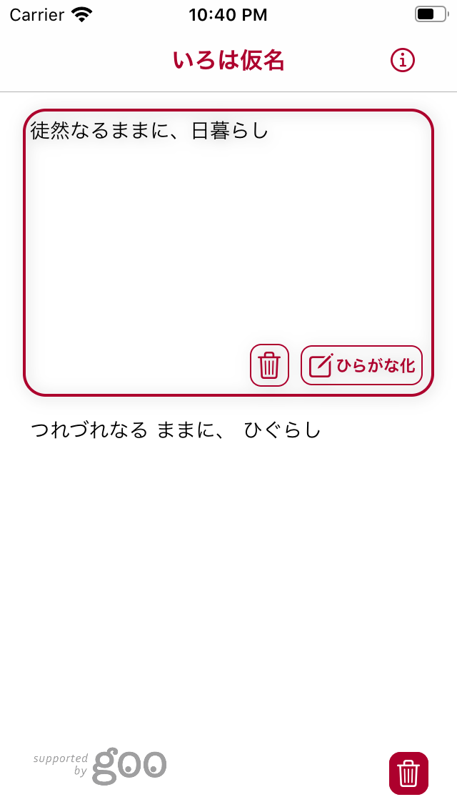
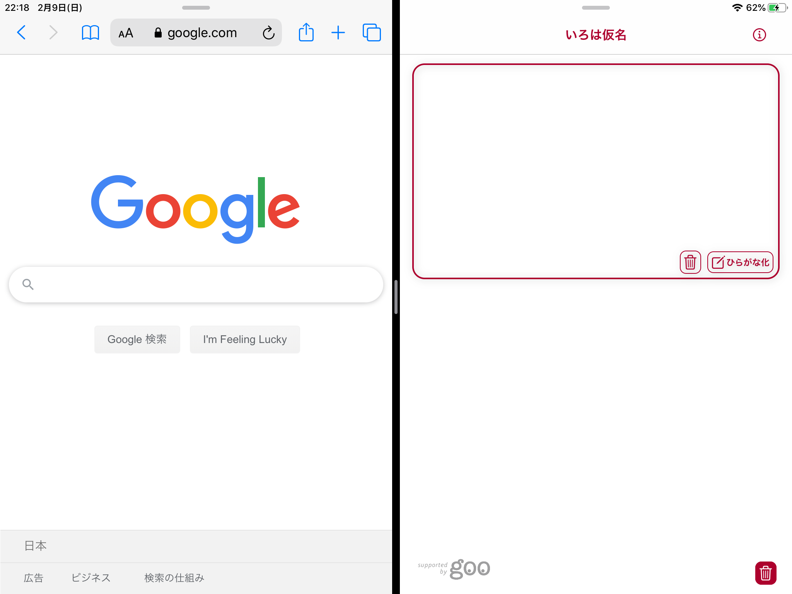

# IrohaGanaApp

🍎 iPhone / iPad<br>
<br>
いろは仮名 - 日本語ルビ出力アプリケーション

## Features
 
日本語文字列をひらがなに変換 ♪<br>

```bash
(example)
"徒然なるままに、日暮らし" -> "つれづれなる ままに ひぐらし"
```

## Screenshot
iPhone <br>
<br>


iPad <br>
* Split View
<br>

<br>
* Slide Over
<br>


## Requirement

* Xcode 11.3.1
* Swift 5
* iOS Development Target 13.2
